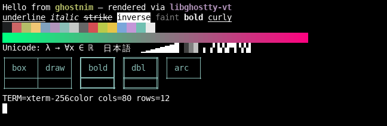

# ghostnim

A terminal emulator written in [Nim](https://nim-lang.org), built on
**libghostty-vt**, the embeddable C library for
[Ghostty](https://ghostty.org)'s terminal core.



libghostty-vt does the actual terminal work: VT parsing, screen and scrollback
state, reflow on resize, key and mouse encoding, selection, and the **render
state**, a snapshot of exactly what to draw with per-row dirty tracking.
ghostnim supplies the rest: an SDL2 window, SDL_ttf glyph rendering, a pty, and
the event loop.

## Features

- Rendering driven by libghostty's render-state API. Only the rows libghostty
  marks dirty are redrawn, into a persistent grid texture.
- Truecolor and 256 colours. Bold, italic, faint, inverse, invisible,
  underline, double underline, strikethrough and overline.
- Wide characters, plus per-glyph font fallback through fontconfig (CJK,
  symbols).
- Font shaping through HarfBuzz: programming ligatures (Monaspace Frozen,
  JetBrains Mono, Fira Code) and contextual alternates (Monaspace's texture healing), kept on
  the cell grid.
- Box-drawing and block characters drawn procedurally, so lines join
  seamlessly between cells.
- Cursor shapes (block, bar, underline, hollow) with blinking.
- Keyboard input through libghostty's key encoder: legacy/xterm sequences,
  DECCKM, and the kitty keyboard protocol when an app requests it.
- Mouse reporting through libghostty's mouse encoder (X10/normal/button/any,
  SGR and more). Hold Shift to select instead.
- Mouse selection, copy (Ctrl+Shift+C), paste (Ctrl+Shift+V or middle click)
  with bracketed paste. Double-click selects the word under the pointer,
  where a "word" is as much as you'd want: a whole URL, path
  (`src/foo.nim:12:3`), flag (`--color=auto`), e-mail address or
  `host:port`, without the sentence punctuation after it. Triple-click
  selects the line. Keep dragging after a double or triple click to extend
  by words or lines. Every selection, Select All included, is copied to the
  clipboard as soon as it's made (turn off with `copy-on-select #false`).
- Ctrl+click opens links with `xdg-open`: OSC 8 hyperlinks, and URLs in the
  text (`https://`, `http://`, `file://`, `mailto:`, `www.` and a few more),
  even when they wrap onto the next line. The pointer turns into a hand over
  a link while Ctrl is held. It works when the application has mouse
  reporting on, too.
- Ctrl+click a path to open it in a new tab: a directory opens a new tab
  there, a file opens in `$VISUAL`/`$EDITOR` in a new tab (or with
  `xdg-open` when neither is set). Relative paths are taken from the tab's
  directory, so the names `ls` prints work, and `src/foo.nim:12:3`,
  git's `a/`/`b/` prefixes and `ls -F`'s `*`/`@` are understood. `file://`
  links to directories (`ls --hyperlink`) open in a new tab too.
- Right-click context menu with Copy, Paste, Select All, zoom, Show/Hide
  Recent Folders,
  Show/Hide File Manager and Open Config, drawn in-window and navigable with the
  arrow keys and Enter. When the application has mouse reporting on, hold
  Shift to open it.
- Scrollback with the mouse wheel or Shift+PageUp/PageDown.
- Tabs, each with its own shell and terminal state. The tab bar shows each
  tab's OSC title. Click a tab to switch to it, click × (or middle-click the
  tab) to close it, and click + to open a new one. The mouse wheel over the bar
  also switches tabs. New tabs start in the current tab's directory.
  Keys: Ctrl+Shift+T new tab, Ctrl+Shift+W close tab, Ctrl+Tab /
  Ctrl+Shift+Tab (or Ctrl+PageDown / Ctrl+PageUp) next / previous tab.
- Recent folders: a strip under the tabs shows the last five directories the
  current tab has been in, most recent first. Each tab keeps its own list
  (a new tab starts with a copy of its parent's). Click one to `cd` there, or
  middle-click it to open it in a new tab; if a program is running in the
  tab, a click opens a new tab too. Turn the strip on or off from the
  right-click menu; the choice is remembered in
  `$XDG_STATE_HOME/ghostnim` (`~/.local/state/ghostnim`).
- File manager: Ctrl+Shift+E (or Show File Manager in the right-click menu)
  splits a folder listing off the left of the window. It shows the current
  tab's directory and follows it as you `cd` or switch tabs. Click a folder to
  `cd` there (while a program is running in the tab, the pane just browses
  there on its own), double-click a file to open it with `xdg-open`,
  middle-click a file to type its quoted path into the terminal, or
  middle-click a folder to open a new tab in it. The listing updates when
  files are added or removed; hidden files are left out. Drag the divider to
  resize the pane; whether it's shown and its width are remembered in
  `$XDG_STATE_HOME/ghostnim`.
  Showing the pane gives it the keyboard (its selection turns the accent
  colour and the terminal's cursor goes hollow): Up/Down, PageUp/PageDown
  and Home/End move, Enter or Right goes into a folder or opens a file,
  Left or Backspace goes up to the parent folder, typing a name's first
  letters jumps to it, Shift+Enter types the selected path into the
  terminal, and Escape (or a click in the terminal) hands the keyboard back.
  Ctrl+Shift+E focuses a pane that's already shown, and hides it once it has
  focus.
- Window title from OSC 0/2, live resize with reflow, HiDPI.
- Font zoom: Ctrl+= (or Ctrl++) / Ctrl+- / Ctrl+0.
- A KDL config file for fonts, window size, shell, start directory, colours
  and keybindings, reloaded live when saved (see [Config file](#config-file)).

## Building

### 1. Dependencies

- Nim ≥ 1.6 (Nim 2.x recommended)
- SDL2 and SDL2_ttf development packages
- HarfBuzz (development package), for ligatures and other font shaping
- fontconfig (`fc-match`) for font discovery and fallback (optional but
  recommended)
- Zig 0.16 and git, to build libghostty-vt

On Debian/Ubuntu:

```sh
sudo apt install nim libsdl2-dev libsdl2-ttf-dev libharfbuzz-dev fontconfig fonts-dejavu-core
# Zig 0.16: https://ziglang.org/download/ (or `pip install ziglang==0.16.0`)
```

The default font, Monaspace Neon Frozen, isn't packaged by most distros:
copy `fonts/frozen/MonaspaceNeonFrozen-*.ttf` from a
[Monaspace release](https://github.com/githubnext/monaspace/releases) into
`~/.local/share/fonts`. Without it ghostnim uses Monaspace Neon if that's
installed, else your system's `monospace` font.

### 2. Build libghostty-vt

```sh
nimble vt            # or: sh scripts/build-libghostty-vt.sh
```

This clones Ghostty at a pinned commit into `vendor/ghostty-src` and installs
headers and libraries into `vendor/ghostty-vt`. To use a libghostty-vt you
already have, set `GHOSTTY_VT_PREFIX=/path/to/prefix`.

### 3. Build ghostnim

```sh
nimble build -d:release
# or: nim c -d:release -o:ghostnim src/ghostnim.nim
./ghostnim
```

ghostnim links libghostty-vt statically by default. Set `GHOSTTY_VT_SHARED=1`
to link the shared library instead (needed if you built libghostty with
`SIMD=true`).

### AppImage

```sh
nimble appimage      # or: sh scripts/build-appimage.sh
```

This builds a release binary and packages it with
[linuxdeploy](https://github.com/linuxdeploy/linuxdeploy), which is downloaded
into `build/tools` on first use. The result is
`ghostnim-<version>-<arch>.AppImage` in the repository root. SDL2, SDL2_ttf
and their dependencies are bundled. If your SDL2 is sdl2-compat (as on Arch),
the SDL3 library it loads at runtime is bundled too. Monaspace Neon Frozen
(the default font), DejaVu Sans Mono and Symbols Nerd Font are bundled as well;
other fonts are still found through the host's fontconfig.

### Prebuilt AppImage and updates

CI (`.github/workflows/appimage.yml`) builds the AppImage on every push and
pull request, and each push to `main` publishes it as the latest
[release](https://github.com/codegod100/ghostnim/releases/latest) as
`ghostnim-x86_64.AppImage`.

Those builds update themselves: at most once a day, on launch, a background
process compares the running AppImage with the latest release (by the SHA-1
in its `.zsync` file). If they differ, it downloads the new AppImage, checks
it, and replaces the file in place, so the next launch runs the new version.
This needs `curl` and `sha1sum` on the host and a writable AppImage file; set
`GHOSTNIM_NO_UPDATE=1` to turn it off. The update information is also
embedded in the AppImage, so AppImageUpdate, Gear Lever and similar tools can
update it too. Locally built AppImages don't self-update unless built with
`NIM_FLAGS=-d:autoUpdate`.

## Usage

```
ghostnim [options] [-e command [args...]]

  -c, --config FILE      config file  [$XDG_CONFIG_HOME/ghostnim/config.kdl]
  -f, --font NAME|PATH   font family (fontconfig) or font file   [Monaspace Neon Frozen]
  -s, --size N           font size in points                      [14]
      --no-font-shaping  draw characters one by one: no ligatures or
                         contextual alternates
      --cols N           initial columns                          [100]
      --rows N           initial rows                             [30]
      --scrollback N     scrollback lines                         [10000]
  -d, --working-directory DIR  start the first tab in DIR  [current directory]
      --no-inherit-directory   start new tabs in the working directory too,
                         not in the current tab's directory
      --screenshot FILE  render one frame after startup to FILE (BMP) and exit
  -e, --exec CMD ...     run CMD instead of $SHELL (must be last)
```

ghostnim sets `TERM=xterm-256color` for the child process.

### Config file

Settings can also go in a [KDL](https://kdl.dev) file at
`$XDG_CONFIG_HOME/ghostnim/config.kdl` (usually
`~/.config/ghostnim/config.kdl`), or wherever `--config` points. Each setting
is a node named after its command-line option, and the command line wins:

```kdl
font "Monaspace Neon"
font-size 13
font-shaping #false    // no ligatures or contextual alternates
cols 120
rows 36
scrollback 50000
command "fish" "--login"
working-directory "~/code"
inherit-directory #false     // new tabs start in working-directory too
copy-on-select #false        // selecting text doesn't copy it

colors {
  foreground "#c0caf5"
  background "#1a1b26"
  cursor "#c0caf5"
  selection-foreground "#c0caf5"
  selection-background "#33467c"
  palette 1 "#f7768e"   // one line per 256-colour palette entry to change
}

keybinds {
  alt+1 goto-tab 1
  ctrl+shift+enter send-text "\n"
  ctrl+shift+w none     // unbind a default
  "ctrl+=" font-bigger  // quote chords containing = / ; [ ] \
}
```

Keybindings add to the defaults listed under Features (use
`keybinds clear-defaults=#true { ... }` to start from none). Actions: `copy`,
`paste`, `select-all`, `new-tab`, `close-tab`, `next-tab`, `previous-tab`,
`goto-tab N`, `scroll-page-up`, `scroll-page-down`, `scroll-to-top`,
`scroll-to-bottom`, `font-bigger`, `font-smaller`, `font-reset`,
`send-text "..."`, `reload-config`, `open-config`, `toggle-file-pane` and `none`.

**Open Config** in the right-click menu (or Ctrl+,) opens the file in
`$VISUAL`/`$EDITOR` in a new tab, or with `xdg-open` if neither is set. If
the file doesn't exist yet it's created from `docs/config.kdl` first.

The config reloads itself when you save it, or on Ctrl+Shift+, (comma). Font,
font shaping, colours, keybindings and scrollback change in the open window; `command`,
`working-directory` and `inherit-directory` apply to new tabs, and
`cols`/`rows` only size the first window.
`working-directory` is only used when ghostnim is launched from your home
directory or `/` (as desktop launchers do), so a file manager's "Open
Terminal Here" still opens in the folder you picked. A file that doesn't parse is skipped and the previous settings stay.

[`docs/config.kdl`](docs/config.kdl) lists every setting with its default and
what it does, so it's a good starting point to copy.
Mistakes such as an unknown setting or a value out of range are reported on
stderr and skipped, so a broken config never stops the terminal from starting.

## Layout

| File | Purpose |
| --- | --- |
| `src/ghostnim.nim` | App: window, tabs, event loop, pty wiring, input, selection, clipboard |
| `src/ghostnim/vt.nim` | Nim bindings for the libghostty-vt C API |
| `src/ghostnim/keys.nim` | `GhosttyKey` enum (generated from `key/event.h`) |
| `src/ghostnim/filepane.nim` | The file manager pane: folder listing, layout and drawing |
| `src/ghostnim/renderer.nim` | Walks the libghostty render state and draws cells and the tab bar with SDL |
| `src/ghostnim/boxdraw.nim` | Procedural box-drawing and block elements |
| `src/ghostnim/input.nim` | SDL scancode/modifier → libghostty key mapping |
| `src/ghostnim/pty.nim` | `forkpty`-based child process |
| `src/ghostnim/sdl.nim` | Minimal SDL2/SDL_ttf bindings |
| `src/ghostnim/config.nim` | Loads the KDL config file |
| `src/ghostnim/keybinds.nim` | Key chords, actions and the default keybindings |
| `src/ghostnim/kdl.nim` | Small dependency-free KDL parser |
| `src/ghostnim/update.nim` | Background self-update for CI-built AppImages |

## Notes

- libghostty-vt's API is still pre-1.0. The bindings target the commit pinned
  in `scripts/build-libghostty-vt.sh`.
- Not implemented yet: Kitty graphics, ligatures/shaping, colour emoji,
  and hyperlinks.
